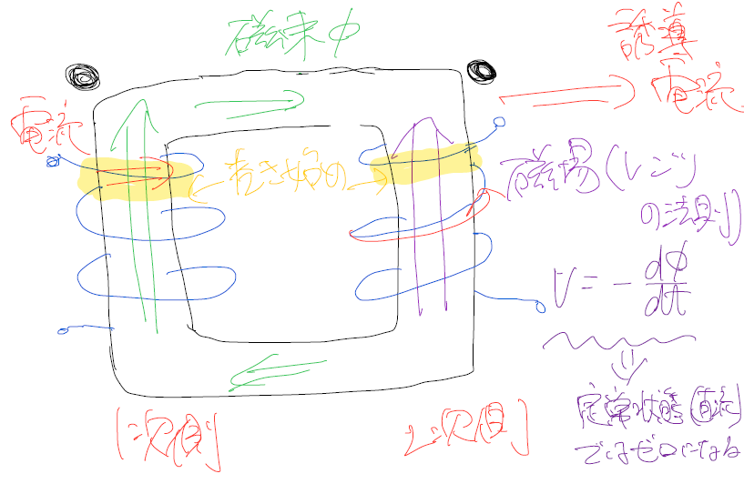
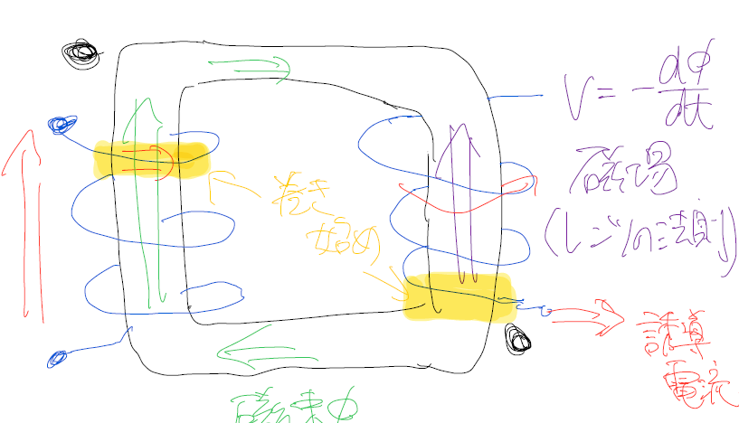

## トランスにおける起電力の向き

本記事では、トランスに生じる起電力の向きを、
磁束変化と符号規約の観点から整理する。

### 符号規約の定義
- 巻線のドット端子側を正
- 電圧はドット端子が正になる向きを正
- 磁束 $\Phi$ は図の矢印方向を正とする

### ファラデーの法則（起電力の大きさ）+ レンツの法則(妨げる向きに働く)

$$
V = -N \frac{d\Phi}{dt}
$$

誘導電流によって、右ねじの法則から磁場の変化を妨げる方向に磁場を発生させるように、誘導電流が流れる。

### ON / OFF 時の違い
ON 時と OFF 時では $\frac{d\Phi}{dt}$ の符号が反転するため、
起電力の向きも反転する。
